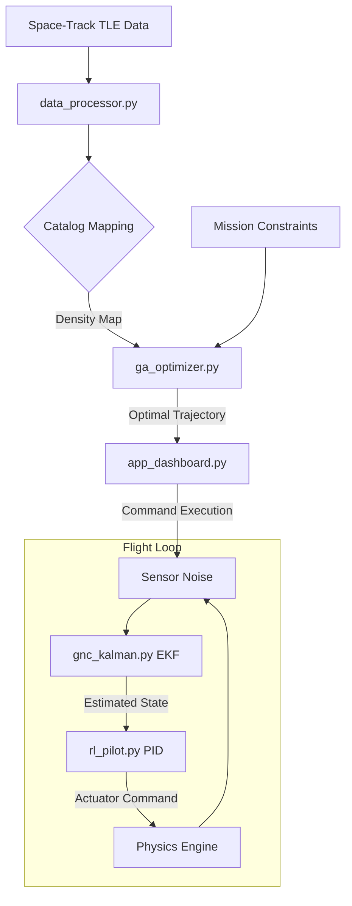

# 🛰️ CommandX: Advanced Orbital Dynamics & Mission Planning

[](https://github.com/yourusername/CommandX)
[](https://github.com/yourusername/CommandX)
[](LICENSE)

CommandX is a high-fidelity orbital mechanics platform designed for satellite constellation management, proximity operations, and mission trajectory optimization. It integrates real-world Space-Track TLE data with advanced GNC (Guidance, Navigation, and Control) algorithms to provide a production-grade simulation environment.

---

## ⚡ The Problem: Orbital Congestion
As of 2024, there are over 17,000 active satellites and hundreds of thousands of debris particles in Low Earth Orbit (LEO). Legacy mission planning tools often:
- **Ignore Live Traffic**: Planning in a vacuum leads to conjunction risks.
- **Simplistic Physics**: Failing to account for J2 perturbations or atmospheric drag.
- **Manual Optimization**: Relying on human intuition for complex multi-constraint transfers.

## 🚀 The Solution: CommandX
CommandX addresses these challenges by automating the "Sense-Analyze-Act" loop for orbital assets:
- **Live Traffic Awareness**: Automatically parses live `3LE` catalogs to map orbital density.
- **Physics-First Optimization**: Uses Genetic Algorithms to find fuel-efficient trajectories that avoid radiation belts and high-drag zones.
- **Robust Estimation**: Implements an Extended Kalman Filter (EKF) to maintain state awareness even with noisy sensor telemetry.

---

## 🏗️ Project Structure

```text
CommandX/
├── app_dashboard.py      # Streamlit UI & Mission Control Center
├── mission_engine.py      # Orbital Physics (J2, Hohmann, Keplerian)
├── ga_optimizer.py       # Trajectory Planning via Genetic Algorithms
├── gnc_kalman.py         # Guidance & Navigation (Extended Kalman Filter)
├── rl_pilot.py           # Actuator Control & PID Logic
├── system_analytics.py   # Monte Carlo IV&V Simulation Suite
├── data_processor.py      # TLE Parsing & Catalog Management
├── graphics_engine.py    # 3D Plotly Tactical Visuals
├── model_3d.py           # Spacecraft Geometry Models
└── requirements.txt      # Project Dependencies
```

---

## 🔄 Workflow Diagram



---

## 🛠️ Getting Started

### Prerequisites
- Python 3.9+
- Pip (Python Package Manager)

### Installation
1. Clone the repository:
   ```bash
   git clone https://github.com/yourusername/CommandX.git
   cd CommandX
   ```
2. Install dependencies:
   ```bash
   pip install -r requirements.txt
   ```

### Running the Platform
Launch the Mission Control dashboard:
```bash
streamlit run app_dashboard.py
```

---

## 📊 Verification & Validation (IV&V)
CommandX includes a professional verification suite to ensure flight readiness. You can run a standalone Monte Carlo analysis to verify GNC robustness:
```bash
python system_analytics.py
```
This will execute 1,000 stochastic docking simulations and report 3-sigma accuracy confidence intervals.

---

## 📜 License
This project is licensed under the MIT License - see the [LICENSE](LICENSE) file for details.
