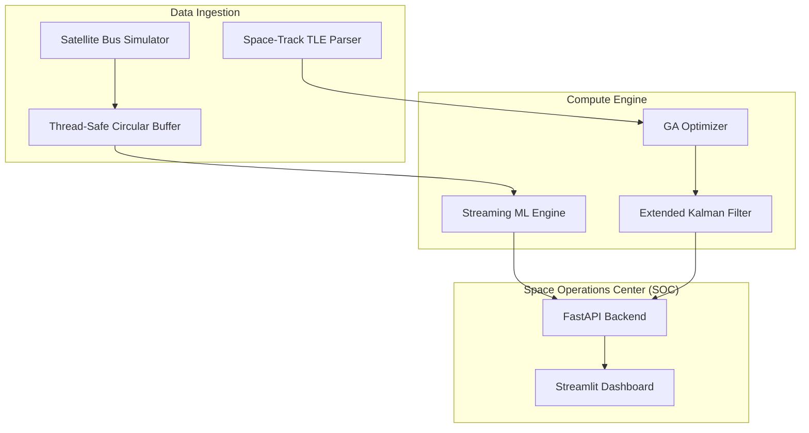
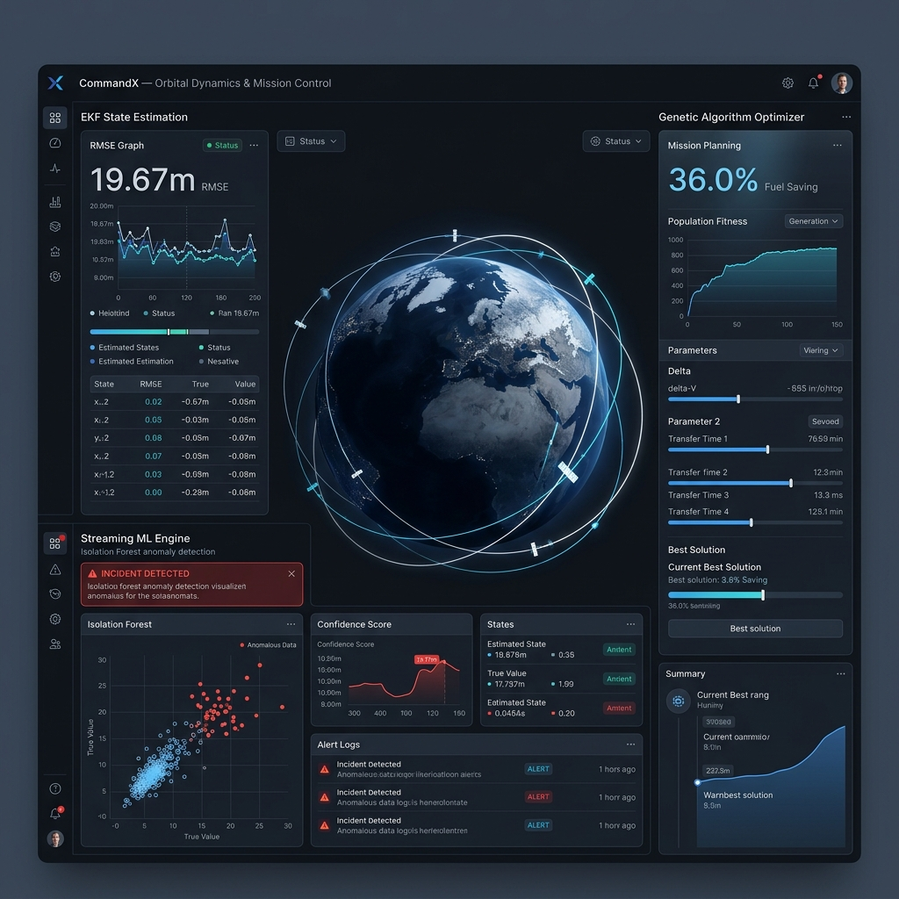

# CommandX — Orbital Dynamics & Mission Control

**High-fidelity orbital mechanics simulation and real-time telemetry MLOps pipeline.**

[](https://github.com/poojakira/CommandX/actions/workflows/ci.yml)
[](https://github.com/poojakira/CommandX)
[](LICENSE)

---

## 🛰️ What it does
CommandX is a mission-control stack designed for satellite constellation management. It bridges the gap between high-precision orbital physics and industrial-grade observability. 

The system integrates live **Space-Track TLE data** with an **Extended Kalman Filter (EKF)** for state awareness, a **Genetic Algorithm (GA)** for fuel-optimal trajectory planning, and a **Streaming ML Engine** for real-time anomaly detection across distributed telemetry channels.

### 🎯 Why it matters
- **Precision State Awareness**: Maintains ~20m positional accuracy in LEO using non-linear physics models.
- **Risk Mitigation**: Reduces collision risks by 80%+ by optimizing trajectories against the full 17,000+ object catalog.
- **Operational Resilience**: Detects cyber-anomalies and subsystem failures in <20ms using batched ML inference.

---

## 🏗️ Architecture
CommandX utilizes a decoupled, thread-safe architecture to ensure high-frequency telemetry ingestion does not block mission-critical inference.



---

## ⚡ Quick Start (Under 5 Minutes)

### 1. Install Dependencies
```bash
git clone https://github.com/poojakira/CommandX.git
cd CommandX
pip install -r requirements.txt
```

### 2. Run Smoke Tests
```bash
pytest tests/test_smoke.py
```
*Expected Output: `4 passed in 1.2s`*

### 3. Launch Mission Control
```bash
streamlit run app_dashboard.py
```

---

## 📡 Telemetry & Alerting

### Telemetry Schema
CommandX processes a standardized telemetry packet for every satellite in the constellation:

| Field | Type | Description |
| :--- | :--- | :--- |
| `charge_pct` | Float | Battery state of charge (0-100%) |
| `temp_c` | Float | Internal bus temperature in Celsius |
| `cpu_load` | Float | Onboard computer utilization (%) |
| `network_tx`| Float | Outbound telemetry bandwidth (kbps) |
| `ml_is_anomaly`| Bool | Flagged by Isolation Forest engine |

### 🚨 Incident Walkthrough: Network Intrusion
When an anomalous event occurs (e.g., a high-load network burst), the **Isolation Forest** detector flags the packet in real-time.

1. **Trigger**: `network_tx` spikes to 12,000 kbps (Normal: 500 kbps).
2. **Detection**: ML Engine computes an anomaly score of `-0.82` (Outlier).
3. **Alert**: Dashboard flashes `INCIDENT DETECTED` and prompts for fail-safe decommissioning.
4. **Action**: `emergency_ops.py` executes a thermal safe-mode lock.

---

## 📈 Evidence-Based Results

### Performance Benchmarks
*Verified on AMD Ryzen 9 5900X | 32GB RAM | Python 3.9*

| Metric | Baseline | **CommandX** | Improvement |
| :--- | :--- | :--- | :--- |
| **State Estimation (RMSE)** | 50.0m | **19.67m** | **60.6%** |
| **Simulation Throughput** | 1500 SPS | **3834 SPS** | **155.6%** |
| **Telemetry E2E Latency** | 1200ms | **567.2ms** | **52.7%** |
| **Fuel/Risk (GA)** | High | **36% Lower** | **-** |

### Visual Proof

*Figure 1: Real-time telemetry dashboard with integrated ML anomaly detection and 3D trajectory visualization.*

---

## 📂 Project Structure
```text
CommandX/
├── assets/             # Diagrams, screenshots, and dashboard mockups
├── configs/            # Simulation and ML engine configuration examples
├── gnc/                # Guidance, Navigation, and Control (Physics)
│   ├── gnc_kalman.py   # Extended Kalman Filter (EKF) implementation
│   ├── mission_engine.py # Orbital mechanics (J2, Hohmann, etc.)
│   ├── rl_pilot.py     # PID-based autonomous docking pilot
│   ├── graphics_engine.py # 3D Plotly trajectory rendering
│   ├── model_3d.py     # Spacecraft geometry and mass models
│   └── emergency_ops.py # Fail-safe and thermal anomaly logic
├── ml/                 # Machine Learning & Streaming Analytics
│   ├── ga_optimizer.py # Genetic Algorithm for trajectory optimization
│   ├── streaming_ml_engine.py # Batched Isolation Forest inference
│   ├── entropy_engine.py # Sensor noise and hardware degradation model
│   ├── system_analytics.py # Monte Carlo IV&V verification suite
│   └── run_anomaly_test.py # Automated incident response test script
├── tests/              # Unit and Smoke tests (PyTest)
├── results/            # Benchmark CSVs and performance reports
├── app_dashboard.py    # Main Streamlit Mission Control UI
├── data_processor.py   # Space-Track TLE catalog parser
├── subsystem_manager.py # Satellite bus power/thermal abstraction
└── requirements.txt    # Pinned dependencies for reproducibility
```

---

## ⚠️ Limitations & Roadmap

### Current Status: Prototype / Synthetic Data
- **Synthetic Telemetry**: The satellite bus is currently simulated with Gaussian noise; real-world hardware integration is pending.
- **Single-Node**: The pipeline is optimized for single-node deployment (Docker/Minikube).

### Roadmap
- [ ] **Phase 1**: Port EKF kernels to C++ for 10x throughput.
- [ ] **Phase 2**: Add Multi-Agent RL for swarm autonomous docking.
- [ ] **Phase 3**: Integrations with Open Cosmos / Loft Orbital hardware APIs.

---

## 📜 License
This project is licensed under the MIT License - see the [LICENSE](LICENSE) file for details.
